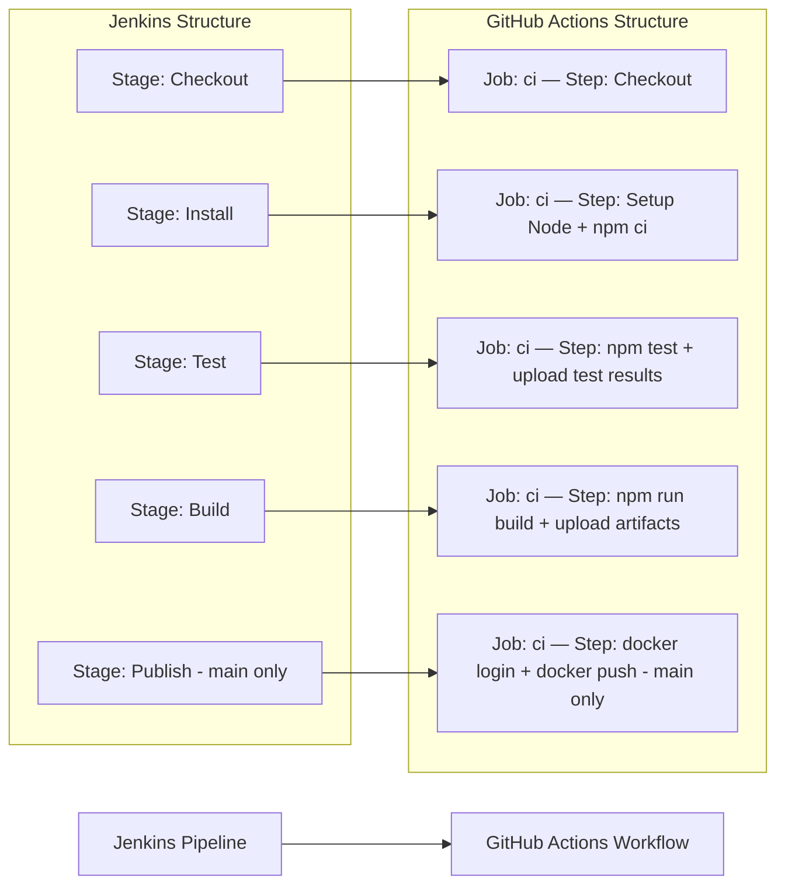

# 🚀 Jenkins to GitHub Actions Migration Report

## 📊 Migration Overview

| Metric           | Before (Jenkins)      | After (GitHub Actions)     |
| ---------------- | --------------------- | -------------------------- |
| Pipeline Files   | 1 (Jenkinsfile)       | 1 workflow (ci.yml)        |
| Pipeline Stages  | 5 stages              | 1 job, 9 steps             |
| Pipeline Steps   | 7 steps               | 9 steps                    |
| Shared Libraries | 0                     | N/A                        |
| Credentials      | 1 (docker-registry)   | 2 secrets                  |

## 🔄 Conversion Diagram



## 🔧 Key Transformations

### Stage and Step Conversions

| Jenkins                                           | GitHub Actions                                                    |
| ------------------------------------------------- | ----------------------------------------------------------------- |
| `agent any`                                       | `runs-on: ubuntu-latest`                                          |
| `checkout scm`                                    | `actions/checkout@11bd71901bbe5b1630ceea73d27597364c9af683` (v4.2.2) |
| `sh 'npm ci'`                                     | `run: npm ci` (with `actions/setup-node` v4.4.0 for Node 20)     |
| `sh 'npm test'`                                   | `run: npm test`                                                   |
| `post { always { junit 'test-results/*.xml' } }`  | `actions/upload-artifact` with `if: always()`                     |
| `sh 'npm run build'`                              | `run: npm run build`                                              |
| `archiveArtifacts artifacts: 'dist/**'`           | `actions/upload-artifact@ea165f8d65b6e75b540449e92b4886f43607fa02` (v4.6.2) |
| `when { branch 'main' }`                          | `if: github.ref == 'refs/heads/main'`                             |
| `withCredentials([usernamePassword(...)])`        | `docker/login-action` with `secrets.*`                            |
| `sh 'docker push ... $BUILD_NUMBER'`             | `run: docker push ... ${{ github.run_number }}`                   |
| `post { always { cleanWs() } }`                  | No-op — GitHub-hosted runners are ephemeral                       |

### Credential and Environment Mappings

| Jenkins                        | GitHub Actions                                |
| ------------------------------ | --------------------------------------------- |
| `credentialsId: 'docker-registry'` (username) | `${{ secrets.DOCKER_REGISTRY_USER }}`   |
| `credentialsId: 'docker-registry'` (password) | `${{ secrets.DOCKER_REGISTRY_PASSWORD }}` |
| `${env.BUILD_NUMBER}`          | `${{ github.run_number }}`                    |
| `${env.NODE_VERSION}`          | `env.NODE_VERSION` (`"20"`)                   |
| `${env.DOCKER_REGISTRY}`       | `env.DOCKER_REGISTRY` (`registry.example.com`) |

### Structural Changes

- All 5 sequential Jenkins stages collapsed into a single GitHub Actions job (`ci`) with sequential steps — this preserves the shared-workspace behaviour of the original.
- The `post { always { junit } }` block became an upload-artifact step with `if: always()` so test results are preserved even on test failure.
- `post { always { cleanWs() } }` removed — GitHub-hosted runners provide a fresh ephemeral workspace per run.
- The `Publish` stage's `when { branch 'main' }` condition became `if: github.ref == 'refs/heads/main'` applied to both the login and push steps.

## ✅ Validation Results

### actionlint

```
No issues found.
```

### Manual Verification Checklist

- [x] YAML syntax validated
- [x] All actions pinned to commit SHAs
- [x] Job dependencies verified
- [x] Environment variables migrated
- [x] Secrets and variables properly referenced — no hardcoded credentials
- [x] Shared libraries N/A
- [x] Parallel stages N/A (pipeline was fully sequential)
- [x] Triggers match original behaviour (push + PR on all branches)

## 🔐 Security

- Docker registry credentials migrated to GitHub Secrets — never stored in the workflow file.
- Least-privilege `permissions: contents: read` applied at workflow level.
- All actions pinned to immutable commit SHAs to prevent supply-chain attacks.

## 🔗 Required Secrets

Configure the following in **Settings → Secrets and variables → Actions**:

| Secret name               | Purpose                                                       |
| ------------------------- | ------------------------------------------------------------- |
| `DOCKER_REGISTRY_USER`    | Username for `registry.example.com` (was `REG_USER`)         |
| `DOCKER_REGISTRY_PASSWORD`| Password for `registry.example.com` (was `REG_PASS`)         |

## 🎯 Next Steps

1. Add `DOCKER_REGISTRY_USER` and `DOCKER_REGISTRY_PASSWORD` secrets in repository Settings.
2. If the registry URL changes, update `DOCKER_REGISTRY` in the `env:` block at the top of `ci.yml` (or promote it to a repository variable).
3. Test the workflow by pushing a commit and verifying each step.
4. Optionally add a `docker build` step before `docker push` if the image is not pre-built elsewhere.

## 📁 Original Jenkins Files

The original Jenkins pipeline file has been moved to `.github/ci-archive/` for reference:

- `Jenkinsfile` → [`.github/ci-archive/Jenkinsfile`](.github/ci-archive/Jenkinsfile)

---
*Migration completed by GitHub Copilot Jenkins Migration Agent*
