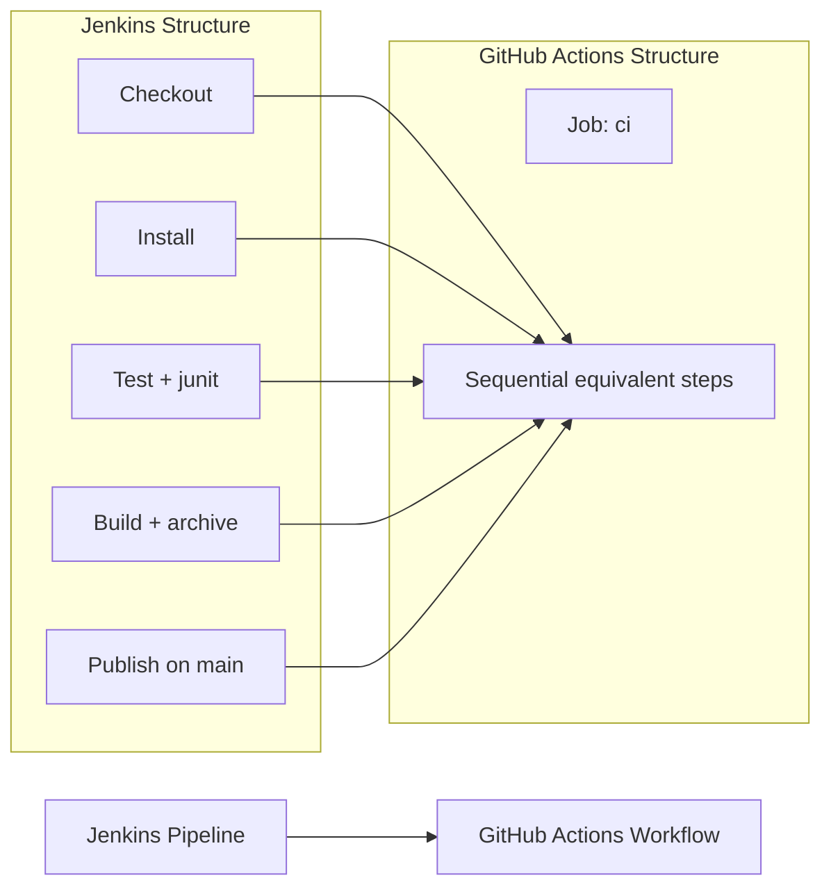

# 🚀 Jenkins to GitHub Actions Migration Report

## 📊 Migration Overview

| Metric | Before (Jenkins) | After (GitHub Actions) |
| --- | --- | --- |
| Pipeline Files | 1 file (`Jenkinsfile`) | 1 workflow (`.github/workflows/ci.yml`) |
| Pipeline Stages | 5 stages | 1 job with equivalent sequential steps |
| Pipeline Steps | 9 steps (including post actions) | 10 steps |
| Shared Libraries | 0 libraries | Expanded inline (N/A) |
| Credentials | 1 credential binding (`docker-registry`) | 2 secrets (`DOCKER_REGISTRY_USERNAME`, `DOCKER_REGISTRY_PASSWORD`) |

## 🔄 Conversion Diagram



## 🔧 Key Transformations

### Stage and Step Conversions

- `checkout scm` → pinned `actions/checkout`
- `sh 'npm ci'`, `sh 'npm test'`, `sh 'npm run build'` → `run:` steps
- `junit 'test-results/*.xml'` → `actions/upload-artifact` for test results
- `archiveArtifacts artifacts: 'dist/**'` → `actions/upload-artifact` for `dist/**`
- `when { branch 'main' }` on publish stage → `if: github.ref == 'refs/heads/main'`
- `BUILD_NUMBER` usage in Docker tag → `${{ github.run_number }}`

### Shared Library Expansions

- No shared libraries were used in the source pipeline.

### Credential and Environment Mappings

- Jenkins `withCredentials(usernamePassword(...))` mapped to:
  - `${{ secrets.DOCKER_REGISTRY_USERNAME }}`
  - `${{ secrets.DOCKER_REGISTRY_PASSWORD }}`
- Jenkins `NODE_VERSION='20'` and `DOCKER_REGISTRY='registry.example.com'` mapped to workflow `env`.

### Structural Changes

- Jenkins stages were converted into one sequential job to preserve ordering and behavior.
- Jenkins `post { always { cleanWs() } }` is naturally handled by ephemeral GitHub-hosted runners.

## ✅ Validation Results

### Linting Results

```
actionlint .github/workflows/*.yml
No issues found (zero output)
```

### Manual Verification Checklist

- [x] YAML syntax validated
- [x] All actions pinned to commit SHAs
- [x] Job/step ordering preserves Jenkins stage flow
- [x] Jenkins credentials migrated to `secrets.*`
- [x] Main-branch-only publish condition preserved
- [x] Original Jenkinsfile archived and removed from root

## 🔐 Security Improvements

- Replaced Jenkins credential binding with GitHub Secrets references.
- Added least-privilege workflow permissions (`contents: read`).
- Pinned all third-party actions to immutable commit SHAs.

## 🔗 Variable and Secret Requirements

### Required GitHub Secrets

- `DOCKER_REGISTRY_USERNAME` - Docker registry username
- `DOCKER_REGISTRY_PASSWORD` - Docker registry password

### Required GitHub Variables

- None required for this migration.

## 🎯 Next Steps

1. Add required repository secrets.
2. Run the workflow on a branch and on `main` to validate runtime behavior.
3. Retire Jenkins job configuration after successful GitHub Actions rollout.

## 📁 Original Jenkins Files

The original Jenkins pipeline file has been moved to `.github/ci-archive/`:

- `Jenkinsfile` → [`.github/ci-archive/Jenkinsfile`](.github/ci-archive/Jenkinsfile)

## 📚 Migration Notes

- The workflow intentionally keeps publish logic as a branch-gated step in the same job, matching Jenkins stage sequence.
- Test report publishing is implemented as artifact archival because Jenkins `junit` does not have a first-party verified equivalent action with the same behavior.

---
*Migration completed by GitHub Copilot Jenkins Migration Agent*
