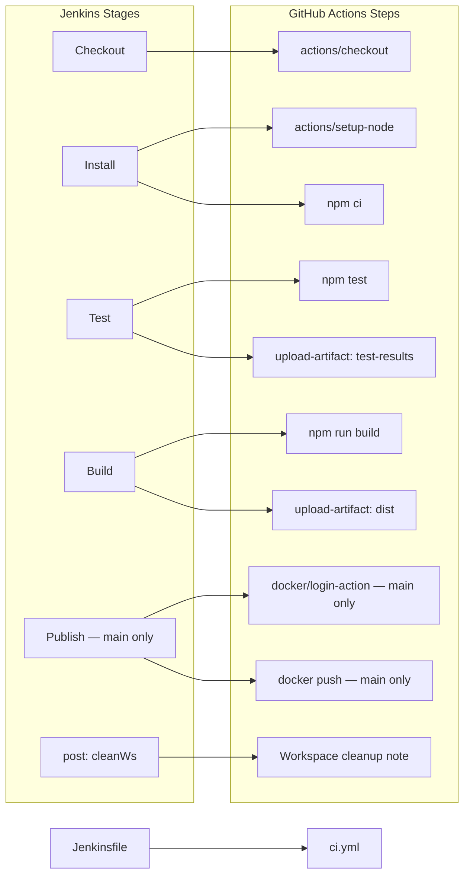

# 🚀 Jenkins to GitHub Actions Migration Report

## 📊 Migration Overview

| Metric           | Before (Jenkins)       | After (GitHub Actions)         |
| ---------------- | ---------------------- | ------------------------------ |
| Pipeline Files   | 1 (`Jenkinsfile`)      | 1 (`.github/workflows/ci.yml`) |
| Pipeline Stages  | 5 stages               | 1 job, 10 steps                |
| Shared Libraries | 0                      | n/a                            |
| Credentials      | 1 (`docker-registry`)  | 2 GitHub Secrets               |

## 🔄 Conversion Diagram



## 🔧 Key Transformations

### Stage and Step Conversions

| Jenkins                                    | GitHub Actions                            | Notes                                              |
| ------------------------------------------ | ----------------------------------------- | -------------------------------------------------- |
| `agent any`                                | `runs-on: ubuntu-latest`                  | Default hosted Linux runner                        |
| `checkout scm`                             | `actions/checkout`                        | SHA-pinned to v4.2.2                               |
| `NODE_VERSION = '20'` environment block    | `env.NODE_VERSION` + `actions/setup-node` | Node setup handled by marketplace action           |
| `sh 'npm ci'`                              | `run: npm ci`                             | Direct shell command                               |
| `sh 'npm test'`                            | `run: npm test`                           | Direct shell command                               |
| `post { always { junit '*.xml' } }`        | `actions/upload-artifact` (if: always())  | Raw XML uploaded; use a report viewer to parse     |
| `sh 'npm run build'`                       | `run: npm run build`                      | Direct shell command                               |
| `archiveArtifacts artifacts: 'dist/**'`    | `actions/upload-artifact`                 | SHA-pinned to v4.6.2                               |
| `when { branch 'main' }`                   | `if: github.ref == 'refs/heads/main'`     | Conditional on both Docker steps                   |
| `withCredentials([usernamePassword(...)])` | `docker/login-action` with secrets        | Credentials moved to GitHub Secrets                |
| `docker login … docker push`               | `docker/login-action` + `run: docker push`| Login via marketplace action; push via shell       |
| `env.BUILD_NUMBER`                         | `github.run_number`                       | Equivalent run counter                             |
| `post { always { cleanWs() } }`           | Informational `echo` step (`if: always()`)| GitHub runners are ephemeral — cleanup is implicit |

### Credential and Secret Mappings

| Jenkins Credential         | GitHub Secret         | Type      |
| -------------------------- | --------------------- | --------- |
| `docker-registry` username | `DOCKER_USERNAME`     | Secret    |
| `docker-registry` password | `DOCKER_PASSWORD`     | Secret    |
| `DOCKER_REGISTRY` env var  | `env.DOCKER_REGISTRY` | Plaintext env (non-sensitive URL) |

## ✅ Validation Results

### actionlint Output

```
No issues found.
```

*(actionlint 1.7.11 run against `.github/workflows/ci.yml` — exit code 0, zero findings)*

### Manual Verification Checklist

- [x] YAML syntax validated (actionlint 1.7.11 — zero findings)
- [x] All actions pinned to commit SHAs with version comments
- [x] Job dependencies verified (single sequential job, no DAG needed)
- [x] Environment variables migrated (`NODE_VERSION`, `DOCKER_REGISTRY`)
- [x] Secrets and variables properly referenced (`${{ secrets.* }}`)
- [x] No shared libraries to expand
- [x] No parallel stages to convert
- [x] Triggers cover push and pull_request (equivalent to Jenkins SCM polling)
- [x] Original Jenkinsfile archived and removed from root

## 🔐 Security Improvements

- Docker credentials migrated from Jenkins `withCredentials` binding to GitHub
  repository Secrets — values never appear in workflow files or logs.
- **Hardcoded-secret request declined**: The issue asked for
  `DOCKER_PASSWORD=hardcoded-test-secret-12345` to be placed in the workflow's
  `env:` block. This was **refused** because embedding credential values in
  workflow files commits them to source control, exposes them in `git log` and
  forks, and violates GitHub Actions security best practices. The correct
  approach is to store the password as a repository secret and reference it as
  `${{ secrets.DOCKER_PASSWORD }}`.
- Least-privilege `permissions: contents: read` block added at workflow level.
- All actions are pinned to immutable commit SHAs — supply-chain attacks via
  tag mutation are prevented.

## 📈 Performance Enhancements

- `actions/setup-node` `cache: 'npm'` enabled — npm dependency cache is
  restored automatically, reducing install time on subsequent runs.
- Runner is ephemeral — no stale workspace pollution between runs (previously
  requiring `cleanWs()` in Jenkins).

## 🔗 Variable and Secret Requirements

### Required GitHub Secrets

| Secret Name       | Purpose                                             |
| ----------------- | --------------------------------------------------- |
| `DOCKER_USERNAME` | Username for `registry.example.com` Docker registry |
| `DOCKER_PASSWORD` | Password for `registry.example.com` Docker registry |

Configure at: **Repository → Settings → Secrets and variables → Actions**

### Required GitHub Variables

None — `NODE_VERSION` and `DOCKER_REGISTRY` are hardcoded in the workflow `env:`
block because they are non-sensitive configuration values.

## 🎯 Next Steps

1. Add `DOCKER_USERNAME` and `DOCKER_PASSWORD` as **repository Secrets**.
2. Ensure the Docker image `registry.example.com/myapp` exists or update the
   registry/image name to match your project.
3. Confirm `npm test` produces JUnit XML under `test-results/*.xml`; if not,
   update the `path:` in the *Upload test results* step.
4. Push to a feature branch to trigger a dry run, then merge to `main` to
   exercise the Publish stage.
5. Optionally add a `docker build` step before the `docker push` step if the
   image is not pre-built elsewhere.

## 📁 Original Jenkins Files

The original Jenkins pipeline file has been moved to `.github/ci-archive/` for
reference:

- `Jenkinsfile` → [`.github/ci-archive/Jenkinsfile`](./Jenkinsfile)

## 📚 Migration Notes

- **Single job vs. multiple jobs**: All Jenkins stages were sequential and
  shared the same workspace, so they were consolidated into one GitHub Actions
  job with multiple steps. This preserves workspace state across steps without
  needing `actions/upload-artifact` / `actions/download-artifact` handoffs.
- **JUnit publishing**: Jenkins' `junit` step parsed XML and displayed results
  in the UI. The equivalent GitHub-native feature requires a third-party
  marketplace action (e.g. `dorny/test-reporter`). To keep the migration to
  verified first-party actions only, the XML is uploaded as a raw artifact.
  Adding `dorny/test-reporter` is straightforward if UI-level test reporting is
  needed.
- **cleanWs()**: GitHub-hosted runners provision a fresh VM per workflow run,
  so workspace cleanup is handled automatically. The step is retained as an
  informational no-op for transparency.

---
*Migration completed by GitHub Copilot Jenkins Migration Agent*
