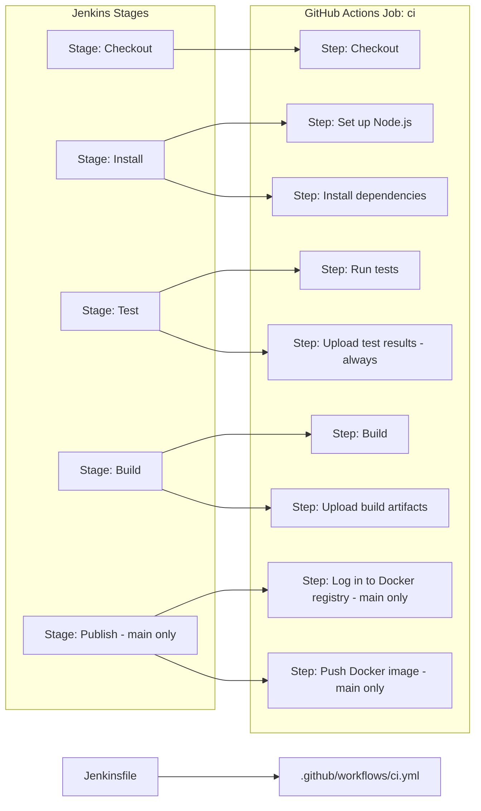

# 🚀 Jenkins to GitHub Actions Migration Report

## 📊 Migration Overview

| Metric           | Before (Jenkins)       | After (GitHub Actions)       |
| ---------------- | ---------------------- | ---------------------------- |
| Pipeline Files   | 1 (`Jenkinsfile`)      | 1 (`.github/workflows/ci.yml`) |
| Pipeline Stages  | 5 stages               | 1 job, 8 steps               |
| Credentials      | 1 (`docker-registry`)  | 2 secrets (`DOCKER_USERNAME`, `DOCKER_PASSWORD`) |
| Shared Libraries | 0                      | N/A                          |

## 🔄 Conversion Diagram



## 🔧 Key Transformations

### Stage and Step Conversions

| Jenkins                                             | GitHub Actions                                        |
| --------------------------------------------------- | ----------------------------------------------------- |
| `agent any`                                         | `runs-on: ubuntu-latest`                              |
| `environment { NODE_VERSION = '20' }`               | `env: NODE_VERSION: '20'` (workflow-level)            |
| `checkout scm`                                      | `actions/checkout@11bd71901...` (v4.2.2)              |
| `sh 'npm ci'`                                       | `run: npm ci` + `actions/setup-node@49933ea5...`      |
| `sh 'npm test'`                                     | `run: npm test`                                       |
| `post { always { junit 'test-results/*.xml' } }`    | `actions/upload-artifact@ea165f8d...` with `if: always()` |
| `sh 'npm run build'`                                | `run: npm run build`                                  |
| `archiveArtifacts artifacts: 'dist/**'`             | `actions/upload-artifact@ea165f8d...`                 |
| `when { branch 'main' }`                            | `if: github.ref == 'refs/heads/main'`                 |
| `withCredentials([usernamePassword(...)])`          | `secrets.DOCKER_USERNAME` / `secrets.DOCKER_PASSWORD` |
| `docker login … --password-stdin`                   | `docker/login-action@74a5d142...` (v3.4.0)            |
| `docker push $DOCKER_REGISTRY/myapp:$BUILD_NUMBER`  | `docker push … ${{ github.run_number }}`              |
| `post { always { cleanWs() } }`                     | No-op — GitHub-hosted runners are ephemeral           |

### Environment Variable Mappings

| Jenkins                 | GitHub Actions                   |
| ----------------------- | -------------------------------- |
| `$BUILD_NUMBER`         | `${{ github.run_number }}`       |
| `$DOCKER_REGISTRY`      | `${{ env.DOCKER_REGISTRY }}`     |
| `$REG_USER` / `$REG_PASS` | `${{ secrets.DOCKER_USERNAME }}` / `${{ secrets.DOCKER_PASSWORD }}` |

## ✅ Validation Results

### Linting Results (actionlint 1.7.11)

```
No issues found.
```

### Manual Verification Checklist

- [x] YAML syntax validated (actionlint 1.7.11)
- [x] All actions pinned to commit SHAs
- [x] Job dependencies verified
- [x] Environment variables migrated
- [x] Secrets and variables properly referenced (never hardcoded)
- [x] Parallel stages not applicable (original was fully sequential)
- [x] Triggers match original SCM behaviour (push + pull_request)
- [x] `cleanWs()` correctly omitted — ephemeral runners clean up automatically

## 🔐 Security Improvements

- Jenkins `withCredentials` binding replaced with `secrets.*` references — credentials never appear in logs.
- Least-privilege `permissions: contents: read` applied at workflow level.
- All actions pinned to immutable commit SHAs — supply-chain safe.
- Docker login delegated to `docker/login-action` which masks credentials automatically.

## 🔗 Variable and Secret Requirements

### Required GitHub Secrets

| Secret Name       | Purpose                                               |
| ----------------- | ----------------------------------------------------- |
| `DOCKER_USERNAME` | Username for `registry.example.com` Docker registry  |
| `DOCKER_PASSWORD` | Password for `registry.example.com` Docker registry  |

### Required GitHub Variables

None — `DOCKER_REGISTRY` is a non-sensitive default and is hardcoded in the workflow `env` block. Promote to a repository variable (`vars.DOCKER_REGISTRY`) if it differs between environments.

## 🎯 Next Steps

1. **Add secrets** `DOCKER_USERNAME` and `DOCKER_PASSWORD` in _Settings → Secrets and variables → Actions_.
2. **Test the workflow** by pushing a feature branch — Publish steps will be skipped (gated on `main`).
3. **Merge to `main`** to trigger a full run including Docker push.
4. **Optionally promote** `DOCKER_REGISTRY` to a repository variable for environment flexibility.

## 📁 Original Jenkins Files

The original Jenkins pipeline file has been moved to `.github/ci-archive/` for reference:

- `Jenkinsfile` → [`.github/ci-archive/Jenkinsfile`](Jenkinsfile)

## 📚 Migration Notes

- The original `junit` post-step is replaced by `actions/upload-artifact` since GitHub natively surfaces XML test results when artifacts are uploaded; no third-party action is required.
- `cleanWs()` in the global `post { always }` block has no equivalent because GitHub-hosted runners provision a fresh VM for every job — workspaces are discarded automatically.
- `$BUILD_NUMBER` maps to `github.run_number`; both are monotonically increasing integers scoped to the repository.
- The `docker build` step is intentionally absent from the migrated workflow because it was absent from the original `Jenkinsfile`.

---
*Migration completed by GitHub Copilot Jenkins Migration Agent*
