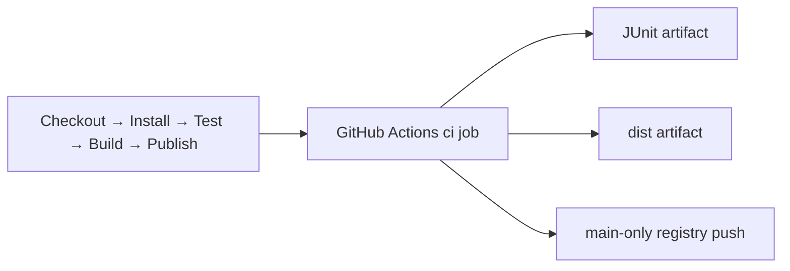

# Jenkins to GitHub Actions Migration Report

## Migration overview

| Metric | Before | After |
| --- | --- | --- |
| Pipeline files | 1 Jenkinsfile | 1 workflow |
| Pipeline stages | 5 sequential stages | 1 sequential job |
| Shared libraries | 0 | 0 |
| Jenkins credentials | 1 username/password credential | 2 GitHub secrets |

## Conversion


```mermaid
graph LR
  J[Checkout → Install → Test → Build → Publish] --> G[GitHub Actions ci job]
  G --> T[JUnit artifact]
  G --> D[dist artifact]
  G --> P[main-only registry push]
```

- `agent any` maps to `ubuntu-latest`.
- `checkout scm` maps to `actions/checkout`.
- Node 20 is installed with `actions/setup-node` before `npm ci`.
- The original command order and failure behavior remain sequential.
- JUnit XML is archived with `if: always()` and missing results fail the step, matching Jenkins' `junit` default.
- `dist/**` is archived after a successful build. GitHub's artifact digest replaces Jenkins fingerprinting.
- Docker login and push run only for a push to `main`; `BUILD_NUMBER` maps to `github.run_number`.
- Jenkins `cleanWs()` needs no explicit replacement because GitHub-hosted runners are ephemeral.
- All marketplace actions are GitHub-maintained and pinned to full release commit SHAs.

## Required secrets

Configure these repository or organization GitHub Actions secrets:

- `DOCKER_REGISTRY_USERNAME` — username from Jenkins credential `docker-registry`.
- `DOCKER_REGISTRY_PASSWORD` — password from Jenkins credential `docker-registry`.

No GitHub Actions variables are required. The non-sensitive registry hostname remains the Jenkins value, `registry.example.com`.

## Validation results

### actionlint

```text
No issues found (actionlint 1.7.11).
```

## Original Jenkins file

The source was moved from `Jenkinsfile` to [`.github/ci-archive/Jenkinsfile`](Jenkinsfile).

## Runtime note

As in Jenkins, publishing only pushes the pre-existing image
`registry.example.com/myapp:<run number>`; the source pipeline does not build a Docker image.
